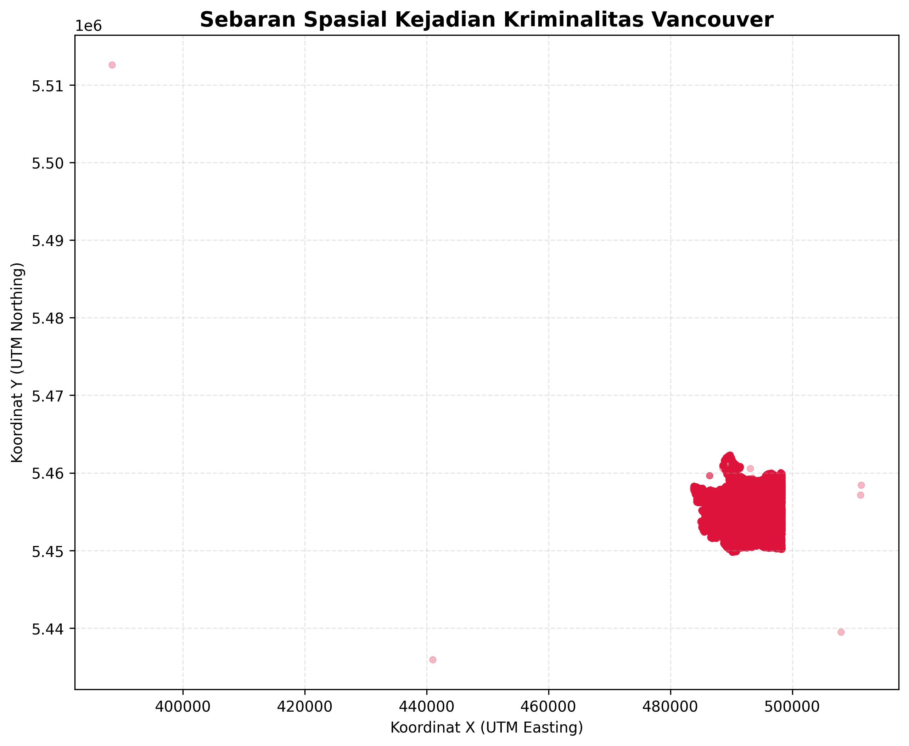
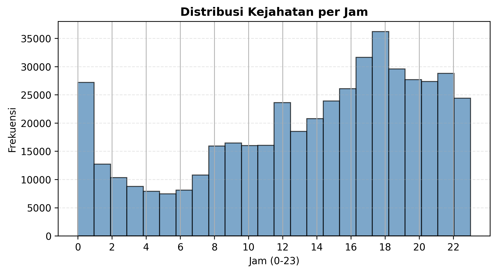
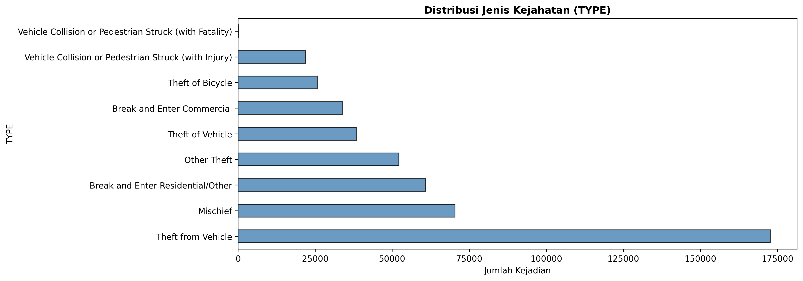
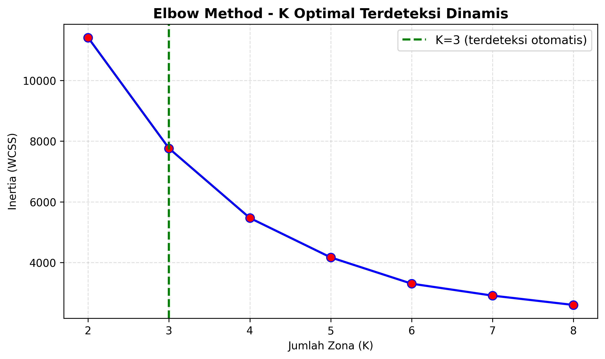
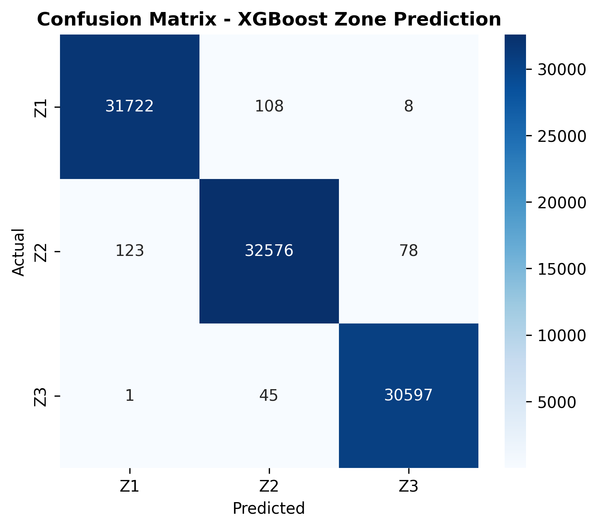
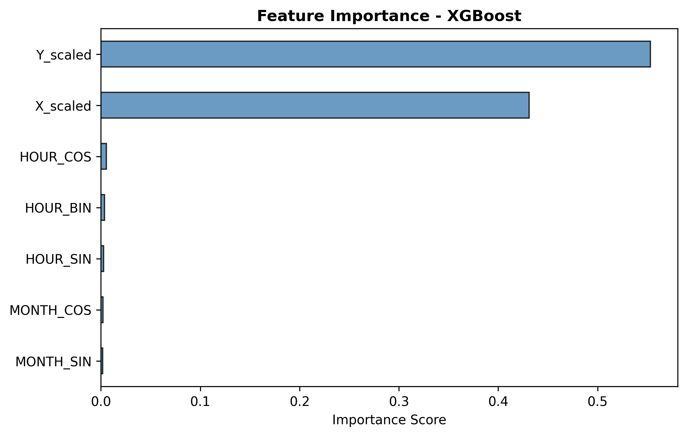
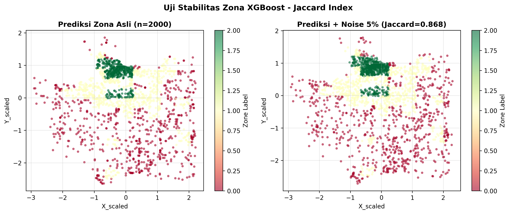
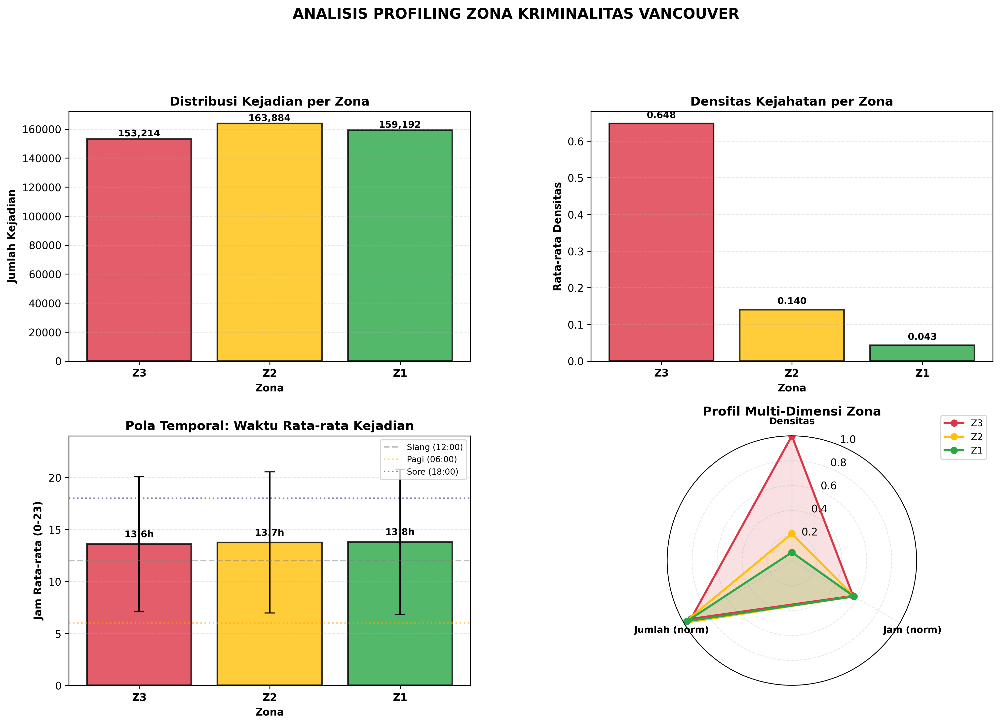
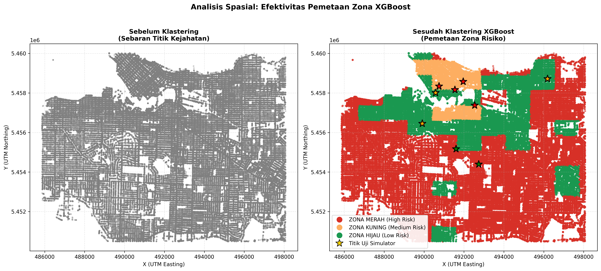

# 🚨 Simulasi Pemetaan Zona Kriminalitas (Crime Zoning) di Vancouver


Proyek ini merupakan simulasi data science terapan untuk melakukan **Pemetaan Zona Kriminalitas (Crime Zoning)** di kota Vancouver. Dengan menggunakan dataset historis tingkat kejahatan, proyek ini membangun sebuah pipeline Machine Learning *End-to-End* yang menggabungkan pendekatan **Unsupervised Learning (K-Means Clustering)** untuk pembentukan zona tingkat kerawanan dan **Supervised Learning (XGBoost Classifier)** untuk memprediksi zona kejahatan berdasarkan fitur spasial dan temporal.

---

## 🎯 Objektif Proyek
1. **Analisis Pola Spasial dan Temporal**: Memahami distribusi titik-titik kejahatan di berbagai lingkungan (neighbourhoods) dan waktu kejadian (jam, hari, bulan).
2. **Crime Clustering (Zoning)**: Mengelompokkan wilayah operasional ke dalam klaster tingkat kerawanan (Rendah, Sedang, Tinggi) menggunakan K-Means secara objektif berdasarkan kepadatan insiden.
3. **Prediksi Zona Kriminalitas**: Membangun model klasifikasi berbasis *Extreme Gradient Boosting* (XGBoost) yang kuat untuk memprediksi probabilitas suatu insiden masuk ke zona tertentu.
4. **Geospatial & Stability Analysis**: Memvalidasi stabilitas klaster yang terbentuk seiring waktu dan memvisualisasikan peta kerawanan untuk pengambilan keputusan strategis pihak berwenang.

---

## 📊 Alur Kerja Metodologi (Pipeline)

1. **Data Ingestion & Preprocessing**: Pembersihan data koordinat yang terkorupsi (invalid X,Y/Latitude,Longitude), penanganan *missing values*, dan transformasi fitur spasial (UTM ke koordinat Standar).
2. **Exploratory Data Analysis (EDA)**: Visualisasi tingkat kepadatan dan tren kejahatan berdasarkan waktu dan jenis kejahatan.
3. **Unsupervised Learning (K-Means)**: Menemukan jumlah klaster optimal (K) menggunakan *Elbow Method* dan menetapkan label 'Zone' berdasarkan titik sentroid.
4. **Supervised Learning (XGBoost)**: Melatih model prediksi multikelas (Multi-class Classification) dengan evaluasi menggunakan *Confusion Matrix*, *Accuracy*, dan ekstraksi *Feature Importance*.
5. **Insights & Profiling**: Pemetaan geografis final menggunakan visualisasi area kerawanan (*Crime Zone Profiling*).

---

## 📈 Visualisasi & Insight Analitik

### 1. Exploratory Data Analysis (EDA)
Pemahaman karakteristik insiden secara mendalam berdasarkan koordinat, jam, dan kategori kejahatan.
<div align="center">
  
  
  
</div>

### 2. K-Means Clustering (Zoning)
Penerapan *Elbow Method* untuk menentukan jumlah wilayah (Zoning) yang paling representatif.
<div align="center">
  
</div>

### 3. Model Evaluation (XGBoost)
Kemampuan prediktif algoritma dievaluasi dengan Confusion Matrix, dan identifikasi fitur spasial/temporal yang paling mempengaruhi model menggunakan Feature Importance.
<div align="center">
  
  
</div>

### 4. Stability & Geographical Mapping
Analisis uji pemantauan apakah zona bergeser secara musiman (Uji Stabilitas) serta bentuk akhir dari *Area Profiling*.
<div align="center">
  
  
</div>

Peta hasil akhir sebaran klaster Kriminalitas:
<div align="center">
  
</div>

---

## 💻 Panduan Instalasi dan Menjalankan Proyek

**Persyaratan Sistem**:
- Python 3.8+
- Jupyter Notebook

**Langkah-langkah**:
1. Clone repositori ini ke dalam direktori lokal Anda:
   ```bash
   git clone https://github.com/username-anda/crime-zoning-vancouver.git
   cd crime-zoning-vancouver
   ```

2. Buat Virtual Environment (opsional namun disarankan):
   ```bash
   python -m venv venv
   source venv/bin/activate  # Untuk Linux/Mac
   venv\Scripts\activate     # Untuk Windows
   ```

3. Instal dependensi (*Library* standar Machine Learning):
   ```bash
   pip install pandas numpy scikit-learn xgboost matplotlib seaborn
   ```

4. Jalankan Jupyter Notebook:
   ```bash
   jupyter notebook "Crime Zoning Vancouver.ipynb"
   ```

---

## 🛠 Teknologi yang Digunakan
* **Python**: Core Language
* **Pandas / NumPy**: Manipulasi & Transformasi Data
* **Scikit-Learn**: K-Means Clustering, Preprocessing, Scaling, Model Evaluation
* **XGBoost**: Extreme Gradient Boosting untuk Prediksi Multi-kelas Zoning
* **Matplotlib / Seaborn**: Visualisasi Analitik & Geospasial

---
Dibuat untuk keperluan Studi Eksplorasi Machine Learning dan Data Science, mensimulasikan lingkungan analisis operasional keamanan publik.
